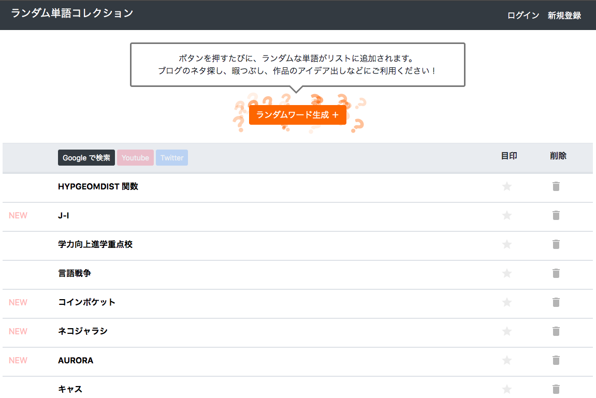

# ランダム単語コレクション

<!-- 画像 -->

## 概要
ボタンを押すと、ランダムな単語がリストに追加されていく。  
使い道は、ブログのネタ探し、アイデア出し、暇つぶしなど様々。  
全く興味の無いことや、知ろうともしなかった新しい事象にふれるきっかけとなる。  
偶然と出会う為のWebサービス。  

## 技術
Ruby on Rails、javaScript、Ajax、SQLite、BootStrap4

